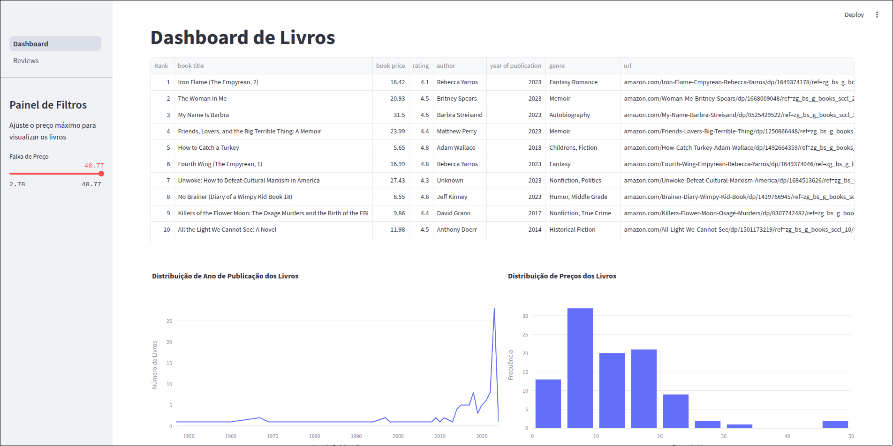
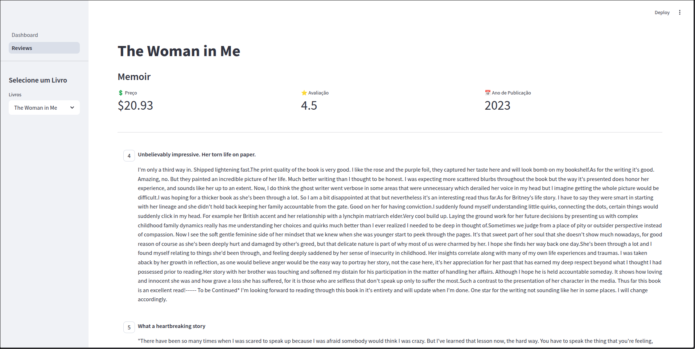

# 📚 Book Dashboard

Este projeto é um **Dashboard interativo** criado com **Streamlit**, que permite visualizar informações e avaliações de livros.

## 🖼️ Demonstrações

|         Dashboard Principal          |        Página de Reviews         |
| :----------------------------------: | :------------------------------: |
|  |  |

---

## 🚀 Funcionalidades

- Visualização de livros com filtros por **preço**.
- Gráficos dinâmicos de:
  - **Distribuição de Preço** dos livros.
  - **Ano de Publicação** dos livros.
- Página dedicada para cada livro mostrando:
  - Título, gênero, preço, avaliação e ano de publicação.
  - Avaliações (reviews) dos leitores no formato de **chat**.
- Navegação entre páginas via sidebar personalizada.

---

## 🛠️ Tecnologias utilizadas

- [Python](https://www.python.org/)
- [Pandas](https://pandas.pydata.org/)
- [Streamlit](https://streamlit.io/)
- [Plotly Express](https://plotly.com/python/plotly-express/)

### Instalação das Dependências

Para instalar todas as dependências necessárias, execute:

```bash
pip install -r requirements.txt
```

---

## ▶️ Como Rodar

1. Clone o repositório:

   ```bash
   git clone https://github.com/seu-usuario/seu-repositorio.git
   cd seu-repositorio
   ```

2. Instale as dependências:

   ```bash
   pip install streamlit pandas plotly
   ```

3. Rode o projeto:
   ```bash
   streamlit run dashboard.py
   ```

---

## 📌 Observações

- Certifique-se de que os arquivos `books.csv` e `reviews.csv` estejam corretamente colocados dentro da pasta `datasets/`.
- As imagens `dashboard.png` e `review.png` são usadas apenas para visualização neste README.
